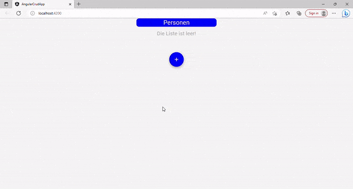

# Angular CRUD Application

This project was generated with [Angular CLI](https://github.com/angular/angular-cli) version 16.0.2.

*Demonstration of the Angular CRUD Application in action.*

## Description

This is a basic CRUD application for managing people. It allows you to perform the following operations:

- Create a new person by providing their ID, first name, last name, and email address.
- Edit the information of an existing person.
- Read the details of a person.
- Delete a person from the list.

## Usage

1. Clone the repository.
2. Install the dependencies by running `npm install` in the project directory.
3. Start the development server with `ng serve`.
4. Open your browser and navigate to `http://localhost:4200` to access the application.
